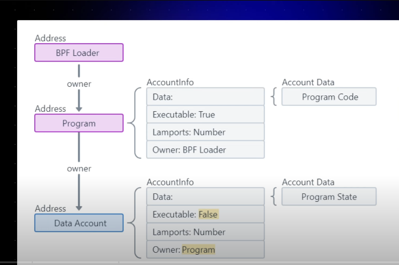
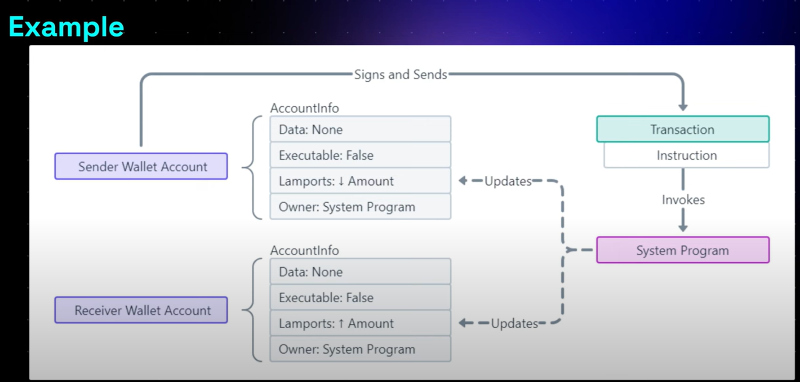

### Ackee Solana Developer Bootcamp Notes
### Overview
- An app interacts with Solana Cluster (Devnet, Testnet, Mainnet-Beta) by sending it transaction with one or more instructions
- The Solana runtime passes these instructions to programs which has been deployed by app Developers beforehand.
- Instructions are executed sequentially and atomiccally for each transaction by the program.
- If any instructions is invalid, all account changes in the transaction are discarded.


### What are Solana Program?
- It is  a piece of code that is deployed (included) to and runs on Node (Validator).
- Similar to regular Rust binaries
    - main() -> entrypoint()
- Programs are stateless. It means you cannot store Data in them.
- We use "Accounts" to store both Program's Code and Data.
    - We can imagine Accounts as "Files". Each Account has unique adddress. 

### What are Solana Account?
- In Solana , everything (all Data-State & Program Code) is stored within Accounts.
- Think of it as key-value pair (Like HashMap in Rust)
- Each Account has Key, Value Paid where key is Account Address (Public Key) and Value is Account Info. 
- This database is stored in the Validator.
- Address of Account - 32 Bytes Long Public Key
- Account Info- (5 Elements- lamports, owner, rent_epoch, executable Flag, Data)
    - Data - A Byte array that stores Data.If the account is a program, this stores executable code.
    - Executable- A boolean flag that indicates if account is a Program.
    - lamports - Accounts balance in lamports
    - Owner - Specifies the public key(Program ID) of the program that owns the account.
- Accounts can store upto 10MB of Data (Data or Program)
- Accounts require rent deposit in sol, proportional to the amount of data stored, which is fully refundable when account is closed.
- If you pay more then 2 years rent, then Account becomes rent exempt.That means we need to pay onnly once.
- Every account has a program "Owner". Only the program that owns the Account can modify its data or deduct its lamport balance. However anyone can increase the balance.
- Account Owner vs Account holder - Account holder has the private key of the Account.
- Programs are stateless that store the executable code.
- Data Accounts are created by Programs to store and manage the Program State.
- Native Programs are buildin programs which are part of the Validator Implementation.
    - System Program (e.g. Performing Sol Transfers)
    - BPF Loader - owner of all other program on the network
    - SYSVAR Accounts are special account that store the network cluster state.
        - Clock Account contains cluster time.


### What is a Transaction?
- Transactions are sent to interact with the Solana Network.
  - User/App sends transaction to the Solana validator to interact with programs deployed in Validator.
  - Transactions include one or more instructions.
    - The execution logic for instructions is stored in the Programs deployed on Validator.
  - Execution Order of Instructions
    - Sequentially
  - Atomicity of Transactions


### Typescript Code for transferring Sol

```
import {
  LAMPORTS_PER_SOL,
  SystemProgram,
  Transaction,
  sendAndConfirmTransaction,
  Keypair,
} from "@solana/web3.js";

// Use Playground cluster connection
const connection = pg.connection;

// Use Playground wallet as sender, generate random keypair as receiver
const sender = pg.wallet.keypair;
const receiver = new Keypair();

// Check and log balance before transfer
const preBalance1 = await connection.getBalance(sender.publicKey);
const preBalance2 = await connection.getBalance(receiver.publicKey);

console.log("sender prebalance:", preBalance1 / LAMPORTS_PER_SOL);
console.log("receiver prebalance:", preBalance2 / LAMPORTS_PER_SOL);
console.log("\n");

// Define the amount to transfer
const transferAmount = 0.01; // 0.01 SOL

// Create a transfer instruction for transferring SOL from wallet_1 to wallet_2
const transferInstruction = SystemProgram.transfer({
  fromPubkey: sender.publicKey,
  toPubkey: receiver.publicKey,
  lamports: transferAmount * LAMPORTS_PER_SOL, // Convert transferAmount to lamports
});

// Add the transfer instruction to a new transaction
const transaction = new Transaction().add(transferInstruction);

// Send the transaction to the network
const transactionSignature = await sendAndConfirmTransaction(
  connection,
  transaction,
  [sender] // signer
);

// Check and log balance after transfer
const postBalance1 = await connection.getBalance(sender.publicKey);
const postBalance2 = await connection.getBalance(receiver.publicKey);

console.log("sender postbalance:", postBalance1 / LAMPORTS_PER_SOL);
console.log("receiver postbalance:", postBalance2 / LAMPORTS_PER_SOL);
console.log("\n");

console.log(
  "Transaction Signature:",
  `https://explorer.solana.com/tx/${transactionSignature}?cluster=devnet`
);

```


