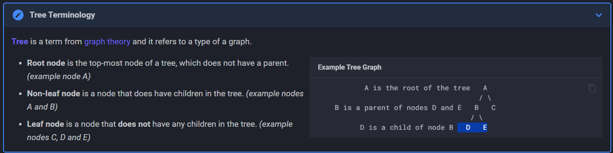

### Ackee Solana Developer Bootcamp Notes
### Overview
- An app interacts with Solana Cluster (Devnet, Testnet, Mainnet-Beta) by sending it transaction with one or more instructions
- The Solana runtime passes these instructions to programs which has been deployed by app Developers beforehand.
- Instructions are executed sequentially and atomiccally for each transaction by the program.
- If any instructions is invalid, all account changes in the transaction are discarded.


### What are Solana Program?
- It is  a piece of code that is deployed (included) to and runs on Node (Validator).
- Similar to regular Rust binaries
    - main() -> entrypoint()
- Programs are stateless. It means you cannot store Data in them.
- We use "Accounts" to store both Program's Code and Data.
    - We can imagine Accounts as "Files". Each Account has unique adddress. 

### What are Solana Account?
- In Solana , everything (all Data-State & Program Code) is stored within Accounts.
- Think of it as key-value pair (Like HashMap in Rust)
- Each Account has Key, Value Paid where key is Account Address (Public Key) and Value is Account Info. 
- This database is stored in the Validator.
- Address of Account - 32 Bytes Long Public Key
- Account Info- (5 Elements- lamports, owner, rent_epoch, executable Flag, Data)
    - Data - A Byte array that stores Data.If the account is a program, this stores executable code.
    - Executable- A boolean flag that indicates if account is a Program.
    - lamports - Accounts balance in lamports
    - Owner - Specifies the public key(Program ID) of the program that owns the account.
- Accounts can store upto 10MB of Data (Data or Program)
- Accounts require rent deposit in sol, proportional to the amount of data stored, which is fully refundable when account is closed.
- If you pay more then 2 years rent, then Account becomes rent exempt.That means we need to pay onnly once.
- Every account has a program "Owner". Only the program that owns the Account can modify its data or deduct its lamport balance. However anyone can increase the balance.
- Account Owner vs Account holder - Account holder has the private key of the Account.
- Programs are stateless that store the executable code.
- Data Accounts are created by Programs to store and manage the Program State.
- Native Programs are buildin programs which are part of the Validator Implementation.
    - System Program (e.g. Performing Sol Transfers)
    - BPF Loader - owner of all other program on the network
    - SYSVAR Accounts are special account that store the network cluster state.
        - Clock Account contains cluster time.


## Token Program
### Fungible and Non-Fungible Tokens
- Fungible Tokens: These tokens are interchangeable with one another. They are indistinguishable and hold the same value.

- Non-Fungible Tokens (NFTs): Each NFT is a special digital asset that holds a unique information or value. NFTs can represent ownership of a specific digital or physical item, such as digital art or real estate.

### Token Program
- Token program defines a common implementation for fungible and non-fungible tokens. All tokens on Solana are created using the SPL Token program.

- Solana's SPL tokens are similar to Ethereum's ERC-20 or ERC-721 standards. However, Solana does not require you to deploy a new contract for each token you create. Instead, you simply send instructions to the Token program, which will create and mint tokens on your behalf.


### Creating Tokens
A token can be created by initializing a new mint account. The mint account is used to create and hold info about new tokens, which are then stored in token accounts. Once a mint account is initialized, the mint_authority can create (mint) new tokens using the MintTo instruction.

- As long as mint account contains a valid mint_authority, it is considered to have a non-fixed supply, and the mint_authority can create new tokens with the MintTo instruction at any time.
Note- Contract is not renounced as they say in ethereum. By setting the mint authority to some NULL address, we can freeze the supply and make the token attribute unchangeable.

### Transferring Tokens
Balances can be transferred between accounts using the Transfer instruction, with the source account owner required as a signer when the accounts differ.

### Burning Tokens
The Burn instruction decreases an account's token balance without transferring to another account. The burnt tokens are permanently removed from the circulation, and this action can be verified on chain.

### Freezing Accounts
The mint account may include a freeze_authority, allowing it to invoke FreezeAccount instruction that will make account unusable. Frozen accounts can be reactivated using the ThawAccount instruction and freeze_authority can be changed using the SetAuthority instruction.

### Wrapping SOL
SOL can be wrapped and used like a Token program token when interacting with programs that use the Token program's interface. Accounts that hold wrapped SOL are associated with Native Mint. Wrapped SOL token accounts have unique behaviors, which you can learn more about here.

### Mint Account
The mint account represents a specific type of token by storing the token's global metadata. The mint account contains these data fields:

- Supply: Total supply of the token.
- Decimals: The number of decimal places the token can be divided into.
- Mint authority: The account authorized to mint new tokens. (Optional)
- Freeze authority: The account authorized to freeze token transfers. (Optional)

### Token Account
A token account on Solana is a general term for any account that holds tokens. Token accounts are created by the Token program and store different types of tokens. Every account has a unique mint address, and a token account holds tokens of a specific mint account.

The Token program is the owner of a token account. However, another account can be specified as the authority with the ability to transfer tokens. This means that while the Token program manages the structure of the token account, another account controls the movement of tokens.


### Token Account Structure
The structure of a token account resembles that of a regular account. It holds lamports, has an executable flag (set to false), owner (Token Program) and stores additional data.

These data fields provide enhanced account management features. For example, you can specify a delegate account, which can then spend tokens up to a delegated_amount.

Main fields:

- Mint: The type of token the account holds.
- Owner: The account with authority to transfer the tokens.
- Amount: The number of tokens the account holds.
Additional fields:

- Delegate: Delegate authority having possession over delegate amount. (Optional)
- IsNative: Specifies whether the token account holds wrapped SOL. (Optional)
- Delegate amount: Amount authorized by the delegate authority.
- Close authority: Authority able to close the token account. (Optional)

### Associated Token Account
- An Associated Token Account (ATA) is a token account, but its address has a special property.
- An Associated Token Account address is derived (as a PDA) from its owner's wallet address and the address of the mint.
- This means that user has a different ATA for every wallet and token mint combination. This is very convenient because programs can easily find and interact with the correct account without needing the user to provide the address.
- A user can receive tokens even if they do not yet have a token account for that mint. The sender is able to fund the creation of the receiver's ATA, enabling things like airdrop campaigns.
- Associated Token Account program facilitates the creation and management of ATAs.

### Token-2022
The Token-2022 program extends the functionality provided by the Token program. This means that the Token-2022 program is not only backward compatible but also includes all the functions of the original Token program, as well as additional functionality often referred to as token extensions.

### Benefits
- Flexibility
Some token extension are incompatible, however, you can create a variety of custom combinations that fit your needs.

- Reduced risk
Using audited and well-tested extensions helps protect protocols and funds.

- Reduced testing costs
Extensions are added by specifying the extensions in code, this reduces number of errors and saves time on testing.

- Reduced development time
Extensions are uniform and reusable, which significantly speeds up development.

### Extensions
There are two types of extensions:
- Mint Extensions
- Token Account Extensions

- Mint extensions are added on top of the original Solana Token program and extend the capabilities of tokens.
- Token account extensions are added on top of Solana accounts and add account-related features.

### Mint extensions:

- Confidential transfers: Confidential transactions that do not reveal the amount transferred.
- Transfer fees: Collection of fees on each transfer. The fees are then sent to a specified account.
- Mint close authority: Enables mint owners to close their accounts and reclaim the lamports.
- Transfer hook: Calls specific programs when a token transfer occurs.
- Interest-bearing tokens: Set an interest rate on a token. The interest can be tracked and displayed.
- Non-transferable tokens: Restrict token transfers between users.
- Permanent delegate: Permanently assign a delegate that has the authority to manage token accounts of a given mint.
- Metadata pointer: Allows token creators to link an external address that contains the official metadata of the token.
- Metadata: Allows integration of metadata into tokens through custom fields.

### Token account extensions include:

- Memo required on transfer: Requires an attached memo as a message during each token transfer.
- Immutable owner: Makes it impossible to reassign ownership of an account.
- Default account state: Freezes all new token accounts so that users must interact with the project in some way to unfreeze the accounts/tokens.
- CPI guard: Restricts how other programs can interact with your token by prohibiting certain actions inside cross-program invocations.

### What is a Transaction?
- Transactions are sent to interact with the Solana Network.
  - User/App sends transaction to the Solana validator to interact with programs deployed in Validator.
  - Transactions include one or more instructions.
    - The execution logic for instructions is stored in the Programs deployed on Validator.
  - Execution Order of Instructions
    - Sequentially
  - Atomicity of Transactions


### Transaction Lifecycle
The following steps can be thought of as an overview of what happens when an app or any user interacts with the Solana network by sending a transaction:

- The user or app submits a transaction with one or more instructions to a node that accepts RPC requests.
- The transaction is then forwarded, according to the leader schedule, to the next leader.
- The leader validates the transaction, processes it, and includes it in a new block. This block is then broadcasted to all other validators who also validate and process the transaction.

During the transaction processing, instructions are executed by the previously deployed programs, and relevant accounts are modified accordingly.

Everything happens in an isolated virtual machine. Instructions are executed sequentially and atomically, which means that either all instructions in the transaction complete successfully or none of the changes are applied.
### Typescript Code for transferring Sol

```
import {
  LAMPORTS_PER_SOL,
  SystemProgram,
  Transaction,
  sendAndConfirmTransaction,
  Keypair,
} from "@solana/web3.js";

// Use Playground cluster connection
const connection = pg.connection;

// Use Playground wallet as sender, generate random keypair as receiver
const sender = pg.wallet.keypair;
const receiver = new Keypair();

// Check and log balance before transfer
const preBalance1 = await connection.getBalance(sender.publicKey);
const preBalance2 = await connection.getBalance(receiver.publicKey);

console.log("sender prebalance:", preBalance1 / LAMPORTS_PER_SOL);
console.log("receiver prebalance:", preBalance2 / LAMPORTS_PER_SOL);
console.log("\n");

// Define the amount to transfer
const transferAmount = 0.01; // 0.01 SOL

// Create a transfer instruction for transferring SOL from wallet_1 to wallet_2
const transferInstruction = SystemProgram.transfer({
  fromPubkey: sender.publicKey,
  toPubkey: receiver.publicKey,
  lamports: transferAmount * LAMPORTS_PER_SOL, // Convert transferAmount to lamports
});

// Add the transfer instruction to a new transaction
const transaction = new Transaction().add(transferInstruction);

// Send the transaction to the network
const transactionSignature = await sendAndConfirmTransaction(
  connection,
  transaction,
  [sender] // signer
);

// Check and log balance after transfer
const postBalance1 = await connection.getBalance(sender.publicKey);
const postBalance2 = await connection.getBalance(receiver.publicKey);

console.log("sender postbalance:", postBalance1 / LAMPORTS_PER_SOL);
console.log("receiver postbalance:", postBalance2 / LAMPORTS_PER_SOL);
console.log("\n");

console.log(
  "Transaction Signature:",
  `https://explorer.solana.com/tx/${transactionSignature}?cluster=devnet`
);

```

### Account Compression
### Merkle Tree
A Merkle tree is a data structure that organizes data into a tree-like form.

Each leaf node inside this tree represents a hash of some data.
Each non-leaf node represents a hash of its child nodes.
The root is a compact representation of all data stored in the tree. Merkle trees allows us to easily verify integrity of the data without having to store all of it on-chain.

Tree Terminology


### Account Compression Program
Minting a single NFT may be relatively inexpensive, however, the cost of storing the asset's data on-chain can quickly become uneconomical as the quantity increases.

The Account Compression program is an on-chain system designed to address the rising concern of storage costs on Solana.

The solution lies in storing a compressed hash of the asset data on-chain, while the actual data is stored off-chain in a database. The data is split into pieces, a Merkle tree is built and only the Merkle root is stored on-chain.

### Zero-Knowledge Compression
- Zero-knowledge (ZK) proofs allow one party to prove to another party that some statement is true without revealing any information about the statement itself.
- ZK proofs can be used to further reduce the amount of data that needs to be stored on a blockchain. With ZK proofs, we can verify that certain calculations or balances are correct without needing to store or reveal the underlying data.


### Anchor Program
An Anchor program consists of three parts. The program module, the Accounts structs 
which are marked with #[derive(Accounts)], and the declare_id macro. The program module 
is where you write your business logic. The Accounts structs is where you validate 
accounts. Thedeclare_id macro creates an ID field that stores the address of your 
program. Anchor uses this hardcoded ID for security checks and it also allows 
other crates to access your program's address.

When you start up a new Anchor project, you'll see the following:
```
use anchor_lang::prelude::*;


// declare an id for your program
declare_id!("Fg6PaFpoGXkYsidMpWTK6W2BeZ7FEfcYkg476zPFsLnS");


// write your business logic here
#[program]
mod hello_anchor {
    use super::*;
    pub fn initialize(_ctx: Context<Initialize>) -> Result<()> {
        Ok(())
    }
}


// validate incoming accounts here
#[derive(Accounts)]
pub struct Initialize {}
```

note that the way an endpoint is connected to its corresponding Accounts struct is 
the ctx argument in the endpoint. The argument is of type Context which is generic 
over an Accounts struct, i.e. this is where you put the name of your account 
validation struct. In this example, it's Initialize.

### The Accounts Struct
The Accounts struct is where you define which accounts your instruction expects 
and which constraints these accounts should adhere to. You do this via two 
constructs: Types and constraints.


### Cross Program Invocation
A Cross Program Invocation (CPI) is a mechanism that allows Solana programs to call other programs from within an instruction. The caller is halted until execution returns from the callee.

Programs can extend their signer privileges to other programs using CPIs. CPIs are executed by calling either invoke or invoke_signed methods within their instructions:

invoke - All necessary signatures are already available before the call.
invoke_signed - Calling program needs PDAs to act as signers during the CPI.

- After a CPI to another program is made, the callee program can make further CPIs to other programs. The maximum CPI depth is 4.
- CPIs are a very powerful feature as they allow developers to make use of other deployed programs and continuously build on and expand the Solana's already existing ecosystem.

### Solana Program Library
The Solana Program Library (SPL) is a collection of on-chain programs. These programs facilitate tasks like creation and management of tokens and more.


### Program Derived Addresses (PDAs): Solana's Key-Value Store #
Data for Solana programs are stored in program-derived addresses (PDAs). Solana's PDAs can be thought of as a key/value store. A PDA can be designed to store any form of data as required by the program.

### Key Concepts #
### Structure

- Key: The PDA's address
- Value: Data stored in the account at that address

###Address Generation

- Seed: chosen by the programmer
- Bump: An additional value to ensure unique PDA creation
- Deterministic: Same combination of seed and bump always produce the same address. This helps the program and the client to accurately determine the address of the data.

### Data Storage

- Programmers define the structure of data stored in PDAs
- Can store any type of program-specific information

### Some properties:

- PDAs are off the Ed25519 elliptic curve. While the data type web3.js uses is a PublicKey, PDA addresses are not public keys and do not have a matching private key.
- A program's PDAs are unique so, they won't conflict with other programs.
- PDAs can also act as signer in an instruction. 

### Benefits #
- Uniqueness: PDAs are specific to your program, avoiding conflicts
- Determinism: Consistent address generation across clients and on-chain programs
- Flexibility: Can store various types of data structures
- Efficiency: Quick lookup and access to program-specific data

