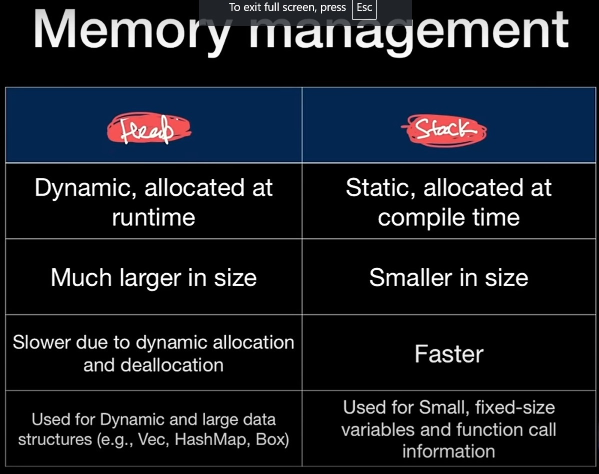
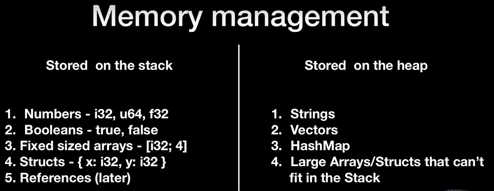

### Rust Notes

### Rust Variables

### functions

### Rust Control Statements

### Structs & Ijmplementation

```
fn main() {
    struct Rect {
        width: i32,
        height: i32,
    }
    let rec = Rect {
        width: 15,
        height: 10,
    };
    impl Rect {
        fn area(&self) -> i32 {
            self.width * self.height
        }
        fn permimeter(&self) -> i32 {
            return (self.width + self.height) * 2;
        }
    }
    let area: i32 = rec.area();
    println!(
        " The Area of Rectanngle with width: {}, height: {} is {}",
        rec.width, rec.height, area
    );
    println!(
        " The Permimeter of Rectanngle with width: {}, height: {} is {}",
        rec.width,
        rec.height,
        rec.permimeter()
    );
}

```

### Enums
```
fn main() {
    enum Directions {
        UP,
        DOWN,
        RIGHT,
        LEFT,
    }
    let mut movement: Directions = Directions::UP;

    match movement {
        Directions::UP => println!("You are moving UP."),
        Directions::DOWN => println!("You are moving DOWN."),
        Directions::RIGHT => println!("You are moving RIGHT."),
        Directions::LEFT => println!("You are moving LEFT."),
    }
}
```

- Another Enum example
```
enum Shape {
    Rectangle(f64, f64), //width,height
    Circle(f64),         //radius
}
fn main() {
    let rec: Shape = Shape::Rectangle(10.0, 15.0);
    // println!("Recatangle Area: {} ",calaculate_area(rec));
    calaculate_area(rec);
    let circle = Shape::Circle(5.0);
    calaculate_area(circle);
    
    fn calaculate_area(shape: Shape) -> f64 {
        match shape {
            Shape::Rectangle(width, height) => {
                let area: f64 = width * height;
                println!("Rectangle Area {}", area);
                area
            }
            Shape::Circle(radius) => {
                let area: f64 = 3.14 * radius * radius;
                println!("Circle Area {}", area);
                area
            }
        }
    }
}

```
- Another Variation
```
enum Shape {
    Rectangle(f64, f64), //width,height
    Circle(f64),         //radius
}
fn main() {
    let rec: Shape = Shape::Rectangle(10.0, 15.0);
    println!("Recatangle Area: {} ", calaculate_area(rec));

    let circle = Shape::Circle(5.0);
    println!("Recatangle Area: {} ", calaculate_area(circle));

    fn calaculate_area(shape: Shape) -> f64 {
        match shape {
            Shape::Rectangle(width, height) => width * height,
            Shape::Circle(radius) => 3.14 * radius * radius,
        }
    }
}
```
### Options/Result Enum (Provided by Rust)
Options - for Null Handling returns Some(T) or None

```
use std::ops::Index;

fn main() {
    let str: String = String::from(" Hello, How are you?");
    let position = find_first_a(str);
    match position {
        Some(i) => println!(" a found at {}", i),
        None => println!("a Not Found!"),
    }
}

fn find_first_a(str: String) -> Option<i32> {
    for (index, char) in str.chars().enumerate() {
        if char == 'a' {
            return Some(index as i32);
        }
    }
    return None;
}

```
- Custom Option Enum Example
```
enum CustomOption {
    Some(i32),
    None,
}
fn main() {
    let str: String = String::from(" Hello, How are you?");
    let position = find_first_a(str);
    match position {
        CustomOption::Some(i) => println!(" a found at {}", i),
        CustomOption::None => println!("a Not Found!"),
    }
}

fn find_first_a(str: String) -> CustomOption {
    for (index, char) in str.chars().enumerate() {
        if char == 'a' {
            return CustomOption::Some(index as i32);
        }
    }
    return CustomOption::None;
}

```
Result - for Error handling return ok(T) or Err(Error)
```
// Write a function that reads the content of a file.
use std::fs::read_to_string;
fn main() {
    let file = read_to_string("file.txt");
    match file {
        Ok(str) => println!("The content of file: {:?} ", str),
        Err(error_message) => println!("The Error Message {:?}", error_message),
    }
}
```

### Package Management
External packages are called crates.
```
cargo add chrono
```
```
use chrono::{Local, Utc};
fn main() {
    // UTC time
    let now = Utc::now();
    println!("The time right now is {} ", now);
    //local Time
    let local = Local::now();
    println!("The Local time now is {}", local);
    //Fomratted UTC Time
    let formatted = now.format("%Y-%m-%d %H:%M:%S");
    println!("Formatted Date & Time is {}", formatted);
}
```
### Memory Management

### Heaps & Stack
Stack is memeory where we keep static data - i.e. size of data does not inncrease
Heap is memory where we keep dynamic data - size of data can increase.




### Mutability
- All variables in RUST are by default immutable.
- To make the variable mutable 
```
let mut var_temp:i32 = 10;
```
